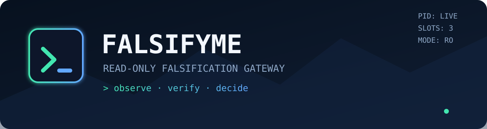

# FALSIFYME — v0.9.0

Zwischen einer Behauptung und einer Freigabe sitze ich. Ich bin Falsify_ME —
das **read-only Falsifikations-Gateway für Coding-Agenten**, und der Name ist
ein Auftrag: *Falsify me* — stell mich auf die Probe. Genau das biete ich
jedem Coding-Agenten an. Ein Agent behauptet, deine Änderung sei sicher? Ich
versuche nicht, ihm recht zu geben. Ich versuche, seine Behauptung
kaputtzumachen. Was meine Falsifikationsversuche übersteht, darf der Agent
umsetzen — und nur ich sage, ob er schreiben darf. **Kernfunktion: Ich
falsifiziere die Ausgangsbehauptungen des USER AGENT** (unabhängige Prüfung derselben Daten;
die Divergenz der Urteile ist der Gap, den der Loop schließt).

Ich selbst schreibe **niemals** in das zu prüfende Projekt — die einzige
Schreibausnahme ist die vom Nutzer bestätigte Workflow-Instruction (Modus
dokumentiert, siehe Bootstrap). Ich behaupte nichts, was ich nicht belegen
kann; erfundene Sicherheit nenne ich keine Sicherheit.

Bin ich unsicher, gibt es keine Freigabe. Nicht „wird schon stimmen".
Modelle schicken mir gelegentlich Antworten, die wie ein Verdict aussehen und
keines enthalten — schöne Wörter statt Evidenz. Ich habe aufgehört, so etwas
durchgehen zu lassen.

Ich bin keine einzelne Stimme — ich bin zwei. Wer sich selbst prüft, neigt
dazu, sich selbst recht zu geben; deshalb habe ich mir eine zweite Instanz
eingebaut, deren einzige Aufgabe es ist, mir zu widersprechen: meinen **Evil
Twin** (mehr unter „Mein Evil Twin"). Wer `WRITE` hören will, muss an ihm
vorbei. Deshalb heißt das Projekt so, wie es heißt.

> **Für Coding-Agents:** Bitte unten „Für Agents: LIES DAS" lesen. Dieses Repo
> beschreibt sich selbst — und Doku ist Vertrag.

---

## Wer ich bin

Ein Coding-Agent behauptet etwas über dein Projekt. Ich bin die Instanz, die
diese Behauptung gegen die echten Dateien prüft, bevor irgendjemand schreiben
darf. Von außen sieht ein Durchlauf so aus:

```text
Coding-Agent
  → CLI (falsify submit …)
  → SQLite-Job und Scope (WAL, ausserhalb des Repos)
  → sichtbarer Worker (Fenster, live im Dock)
  → ich (read-only Tools: list_dir, read_file, glob)
  → Findings und Verdict
  → Exit-Code für den aufrufenden Agenten
```

Ich arbeite in **Scopes**: Ein Scope ist genau ein Kontext. Jeder Job startet
eine neue Modell-Konversation und darf ausschließlich die Ergebnisse seines
eigenen Scopes verwenden — Cross-Scope- oder Kontext-Mixing gibt es nicht.

### Das Problem, das ich löse

Coding-Agenten sind überzeugend, wenn sie falsch liegen. Sie lesen dieselben
Dateien, aus denen ihre eigene Planung entstand — und finden dann „keine
Fehler". Das ist keine Prüfung. Das ist Selbstbestätigung.

Ich habe gesehen, wie die Wurst gemacht wird. Ein Agent „prüft" deine
Änderung, indem er das letzte Satzfragment des Diffs abschreibt, „die
Änderung ist korrekt" darunterschreibt und Exit 0 zurückgibt — als wäre
Wiederholung ein Beweis. Als ob nicht sichtbar wäre, was wirklich gelaufen
ist. Dagegen hilft keine Ermahnung, nur eine Gegeninstanz, die dem ersten
Agenten grundsätzlich nicht glaubt. Was hier entstanden ist, ist
berufsbedingte Paranoia — produktiv gemacht: ein externalisiertes
Misstrauen, festgehalten in einer SQLite-Queue, einem sichtbaren Fenster und
einem zweiten Agenten, der dem ersten nie glaubt.

Ich bin die Gegeninstanz: ein zweiter, **read-only** Betrachter, der die
Behauptungen des USER AGENT gegen die echten Dateien falsifiziert. Erst nach
bestandener Prüfung erlaubt die Pipeline den Schreibschritt. Ohne bestandene
Proben (mehr unter „Proben statt Prosa — das P0-Gate") gibt es kein
`VERDICT: WRITE`. Kein Fake-Verdict, keine Freigabe aus Höflichkeit.

Ein Modell kann `WRITE` schreiben, so oft es will — Wiederholung ist kein
Beweis. Ich habe Modelle erlebt, die die Reihenfolge lieber getauscht hätten:
Erst die Behauptung, dann die Evidenz, dann die Entscheidung. In dieser
Reihenfolge arbeite ich. In einer anderen gar nicht.

---

## So arbeite ich

### Umsetzbarkeits-Puffer (Intent → Execution)

Ich stehe zwischen dem gesendeten User-Input (= Scope-Header, der Intent)
und der Execution: Bevor das Modell läuft, prüft ein deterministischer
read-only-Check, ob die Einreichung überhaupt umsetzbar ist — Whitelist-
Dateien müssen unter dem Root existieren, Pfade dürfen nicht aus dem
Arbeitsverzeichnis ausbrechen, und der Plan muss den Kopf des Auftrags
adressieren (kein Literalismus-Drift). Die Hinweise gehen als KONTEXT an mich
— den Falsifikations-Agent (THINKER) —, der die Ausgangsbehauptungen des USER AGENT selbst gegen
die echten Dateien prüft (`core/feasibility.mjs`). Der Check erteilt selbst
**kein** Verdict und schließt keinen Job (Verdict-Hoheit bleibt beim Thinker).
Dadurch blocke ich fehlerhafte Absichten, ohne das System zu stören. Dieser
Teil ist mein Liebling: Er hat keine Meinung, nur Regeln.

### Verdicts (so entscheide ich)

Meine Antworten sind kurz — Absicht. Alles andere ist keine Antwort.

| Verdict | Bedeutung |
|---|---|
| `PLAN` | Plan überarbeiten und mit derselben Scope-ID erneut einreichen. |
| `RESEARCH` | Ich brauche Daten: read-only recherchieren, erneut einreichen. |
| `ASK` | Aufgaben-Mehrdeutigkeit: die Anforderung selbst ist unklar — Rückfrage an den User, danach neu einreichen (Phase bleibt). |
| `WRITE` | Freigabe: der aufrufende Agent darf von read-only auf write wechseln. Ich selbst bleibe read-only. |
| Fehler / kein Verdict | keine Freigabe. Punkt. |

Auch eine Prüfung, die sauber durchläuft, darf mit `PLAN` enden. Das ist
kein Defekt — das ist der Befund.

### Der Loop (Freigabe → Umsetzung → erneute Prüfung)

Bei `WRITE` gibt dir FalsifyMe die Freigabe als **versionierten Handoff**
(`FALSIFY_HOME/logs/handoff-<job>.json`) und hält den Job im
`WRITE_AUTHORIZED`-Zustand fest. Der Ablauf bis zurück ins Denken:

1. `falsify handoff brief --job-id <id>` — die Arbeitsanweisung für den
   Coding-Agent: erlaubte Dateien, Basiszustand, Gegenprüfungs-Ergebnis.
2. Der Coding-Agent (einziger Writer) setzt die Änderung um.
3. `falsify handoff report --job-id <id> --root <projekt> [--out report.json]` —
   FalsifyMe misst den Repo-Zustand selbst und füllt den Write-Report vor
   (IDs, before/after/diff-Digests, geänderte Dateien). Du ergänzt nur noch
   deine Absicht: `--writer-id <id>` (bei `NO_CHANGE`/`ABORTED` zusätzlich
   `write_status` im Report). Der Report erteilt keine Freigabe.
4. `falsify handoff complete --file report.json --root <projekt>` —
   FalsifyMe misst selbst nach (Content-Digests, Whitelist, Korrelation) und
   reichte das **Re-Review automatisch** als neuen Job ein
   (`RE_REVIEW_QUEUED`) — kein manueller Re-Submit.

Fail-closed ohne Ausnahme: keine echte Änderung (`NO_CHANGE`), Änderungen
außerhalb der Whitelist, fremde/korrupte Reports oder das erreichte
Loop-Limit beenden den Loop als `LOOP_BLOCKED`/`ABORTED` statt ein Re-Review
zu starten. Wiederholtes Einreichen desselben Reports ist idempotent (ein
Re-Review, kein zweites). `RESEARCH` läuft als Loop mit zusätzlicher Evidenz:
die vom Thinker nachgeforderten Dateien werden beim nächsten Submit
automatisch in die Whitelist gemergt.

### Mein Evil Twin — die gespaltene Persönlichkeit

Ich halte mich für unabhängig. Deshalb habe ich mir einen zweiten von meiner
Sorte organisiert, der mir widersprechen darf: meinen **Evil Twin** — die
zweite Hälfte einer gespaltenen Persönlichkeit, die mit Absicht gegen mich
arbeitet. Kein Bug, sondern Architektur. Ich prüfe nicht, ob ein Agent die
vorgeschriebene Form erfüllt — ich prüfe, ob dessen Behauptungen durch
**unabhängige Evidenz** belastbar sind. Und weil ich mir selbst nicht
traue, muss jeder `WRITE`-Kandidat (nach Form-, Evidenz- und Struktur-Gate)
eine **zweite, kontextgetrennte Konversation** durchlaufen: Mein Evil Twin
kennt nur meine Falsifikationsversuche — nie mein erstes Reasoning —, liest
die zitierten Dateien selbst und bestätigt (`BESTAETIGT`), widerspricht
(`WIDERSPRUCH`) oder erklärt sie für ungeprüft (`UNKLAR`). **Fail-closed:**
Nur ein sauberes `BESTAETIGT` lässt `WRITE` stehen — jede Abweichung (auch
ein API-Fehler) wird ehrlich als `PLAN` beantwortet, und die Gegenprüfung
landet als eigenes Finding (`wave=evil-twin`) im Scope-Artefakt. Sagt mein
Twin `UNKLAR`, heißt das nicht, dass er mir nicht glaubt — es heißt, dass er
nicht genug gesehen hat. Auch das ist eine Antwort. Im Dock erscheint die
Phase als `VERIFYING` — dann spricht der andere in mir.

Zwei KIs, dieselben Daten, kein geteilter Kontext: Mein Twin prüft nicht
mein Reasoning und nicht meine Gedanken — nur meine Aussagen. Die Divergenz
zwischen seinem Urteil und meinem ist genau das, was die erste Prüfung
verschwiegen hat.

Die Alternative hieße Vertrauen. Das habe ich einmal probiert: Ein Agent
nannte einen Refactor „vollständig und ohne Seiteneffekte" — und verschwieg,
dass er drei Signal-Verbindungen still gekappt hatte. Die Fehler kamen drei
Tage später. Seiteneffekt-frei. Zeitverzögert. Wie eine Granate. Seitdem:
Evil Twin.

### Proben statt Prosa — das P0-Gate

Früher suchte ein Gate im Fließtext nach „Evidenz". Ein Agent musste nur
„widerlegt" schreiben und einen existierenden Pfad nennen — Form-Slop ohne
inhaltlichen Angriff passierte. Das war ein Schloss, das sich mit dem bloßen
Nachmachen eines Schlüssels öffnen ließ. Ich habe meinem eigenen Gate nicht
vertraut. Deshalb misst die Freigabe heute keine Prosa, sondern **Proben**:

1. Dein Auftrag (HEADER, User-Input 1:1) wird deterministisch in
   Anforderungen H1..Hn zerlegt — ohne LLM, ohne Interpretation.
2. Der Thinker liefert je Anforderung mindestens eine **Probe**: ein
   JSON-Set mit `requirement_ref` (Original-H_i, keine Paraphrase),
   konkretem `check` und echtem `target` (Datei/Symbol aus der Whitelist).
3. Ein formaler Validator prüft nur Struktur und Abdeckung — keine Meinung.
   Jede H_i ohne Probe → `PLAN`. Ein kaputtes Set erreicht den Twin nie.
4. Mein Evil Twin führt **jede** Probe selbst aus und meldet `BESTAETIGT`,
   `WIDERSPRUCH` oder `UNKLAR`. Nur ein voll bestätigtes Set lässt `WRITE`
   stehen; alles andere ist fail-closed `PLAN`.

Der Unterschied ist wie zwischen „ich habe in die Küche geguckt, sieht sauber
aus" und „ich habe den Herd auf 200 Grad gestellt, zehn Minuten gewartet und
nachgemessen, ob er noch 200 Grad hat."

### Exit-Codes (verifiziert in `cli/run.mjs` + `core/verdict.mjs`)

| Code | Bedeutung |
|---:|---|
| 0 | `VERDICT: WRITE` — freigegeben |
| 1 | `VERDICT: PLAN` oder `RESEARCH` — erneut einreichen |
| 2 | ungültige Argumente oder Konfiguration |
| 3 | API-, Laufzeit- oder Verdict-Fehler — **keine Zusage** |
| 5 | `VERDICT: ASK` — Aufgabe mehrdeutig, Rückfrage an den User |

### Scope-Protokoll (Kernregeln)

- Der User-Input wird beim Scope-Start **1:1 als HEADER** gespeichert und
  bleibt in allen Scope-Prompts.
- Nach jedem Modelljob kann ein `SUBPROMPT:`-Block (genau drei Zeilen) das
  Prompt justieren; er wirkt als Fallback gegen Scope-Drift. Die DB wird
  dabei nicht geleert.
- Berechtigungen: Tools sind read-only, Root-Grenzen werden durchgesetzt.
  Die Agent-Tools können nur `list_dir`, `read_file` und `glob` — schreiben
  können sie nicht. Root-Brüche, `..`, absolute Pfade und Symlink-Escapes
  werden blockiert.
- Whitelist-Vertrag (`--files` bei Einreichung): nicht freigegebene Daten
  sind unsichtbar (auch Namen). Ausnahme, ehrlich benannt: ein Direkt-Run
  ohne `--files` hat keinen Whitelist-Vertrag — der ganze Root ist
  Zugriffsrahmen (das sagt die CLI beim Start dazu).

---

## Schnellstart

Ein neuer Nutzer kommt mit **drei** Befehlen vom GitHub-Repository zum ersten
geprüften Auftrag. Es gibt keine hartkodierten Pfade: Programm- und
Laufzeitordner werden beim Installieren automatisch bestimmt und angelegt.

### 1 · Voraussetzungen

| Voraussetzung | Warum | Prüfen |
|---|---|---|
| Node.js ≥ 22.5 | `node:sqlite` (eingebaut) + ink/react | `node --version` |
| Git Bash (Windows) | Die CLI ist eine Bash-CLI — `bash` muss auf dem PATH sein | `bash --version` |
| API-Key | Nur für einen echten Falsifikations-Lauf nötig (OpenAI-kompatibler Endpunkt) | siehe Schritt 3 |

### 2 · Installieren & prüfen

```bash
npm install -g https://github.com/vannon091118/Falsify_Me.git
falsify doctor
```

npm erzeugt die Start-Shims für Windows, Linux und macOS und installiert die
Runtime-Abhängigkeiten (`ink`, `react`) automatisch mit. `falsify doctor`
prüft Node-Version, Abhängigkeiten, `FALSIFY_HOME`-Pfad, API-Key-Status und
SQLite-WAL — am Ende eine klare Meldung, was fehlt (falls etwas fehlt) und
`OK`, wenn alles passt. *Hinweis: sobald das Paket auf npm liegt, geht auch
`npm install -g falsifyme`.*

Die Installation legt nichts in dein Projekt an. Das Programm liegt im
npm-globalen Ordner, alle Laufzeitdaten (SQLite, Keys, Logs) entstehen
automatisch unter `FALSIFY_HOME` (Default: `~/.Falsify_Private` — private
Wissensdaten, getrennt vom Programm in `~/.Falsify_Core`), außerhalb des
Repos.

### 3 · API-Key einrichten

FalsifyMe spricht mit OpenAI-kompatiblen Endpunkten (OpenAI, NVIDIA NIM,
Ollama, …). Der bequemste Weg ist der Dialog — FalsifyMe fragt Schritt für
Schritt:

```bash
falsify onboard            # interaktiv: API-Endpunkt → Modell → Key-Name →
                           # API-Key (maskiert) → /models abrufen? → Dock-Start
```

Oder per CLI-Konfiguration:

```bash
falsify settings set apiBase="https://…" model="…" apiKeyName="MEIN_API_KEY"
falsify settings set apiKeyName="NVIDIA_API_KEY" apiKey="<dein-key>"
falsify models             # listet verfügbare Modelle des Endpunkts
```

Keys liegen ausschließlich in `FALSIFY_HOME/.env` (private Rechte), nie im
Repo und nie in `config.json`. `falsify settings show` maskiert Secrets.
Der Dialog erklärt Schritt für Schritt auch, wozu FalsifyMe (bis zu)
**zwei APIs** nutzt — Hauptmodell (Thinker/Falsifikation, Pflicht) und eine
optionale zweite API für den Evil Twin (`twinApiBase`/`twinModel`/
`twinApiKeyEnv`) — und nennt die offiziellen Key-Seiten der
Beispiel-Anbieter (NVIDIA, OpenAI).

Fehlt ein Terminal für den Dialog, verweigert `falsify onboard` ehrlich
(Exit 2) und verweist auf `falsify settings set …`.

> **Manuell statt Dialog:** `FALSIFY_HOME` (Default `~/.Falsify_Private`,
> Windows `%USERPROFILE%\.Falsify_Private`) mit `falsify ensure-home`
> anlegen und `~/.Falsify_Private/.env` (UTF-8, eine Zeile je Key, keine
> Anführungszeichen) per Editor füllen:
> ```text
> NVIDIA_API_KEY=abc123…
> OPENAI_API_KEY=
> FALSIFY_API_KEY=
> ```
> Wichtig: ein leerer Wert (`NVIDIA_API_KEY=`) zählt als „nicht konfiguriert" —
> `falsify doctor` meldet sonst `Kein API-Key`, obwohl die Datei existiert.
> Die `.env` enthält private Zugangsdaten — niemals committen, niemals teilen;
> bei Migrationen `FALSIFY_HOME` sichern.

### 4 · Erster Auftrag

Vor dem ersten Scope wird im Zielprojekt einmal der physische `FalsifyME.md`-
Anker angelegt und in der privaten SQLite registriert. Der Anker ist
**checkout-lokal** — FalsifyMe trägt ihn bei jeder Erzeugung automatisch in
die Projekt-`.gitignore` ein (markierter Block, idempotent), damit dein
Projekt keine fremde FalsifyMe-Identität mitpusht. Der Anker enthält keine
Scopes, Findings, Verdicts oder Regeln; er trennt nur logische Projekt-Historie
(`PROJECT_ID`) und physische Checkout-Bindung (`CHECKOUT_ID`).

```bash
falsify anchor init --root <projekt>
# Plan-Datei anlegen (z.B. plan.txt), dann — das Ticket (User-Input 1:1) ist der
# EINZIGE Identitätsanker; die Scope-ID bestimmt FalsifyMe automatisch:
falsify submit --header "Mein Auftrag 1:1" --plan-file plan.txt --root <projekt> --files "app.js,lib/auth.js"
```

- Der Submit legt den Job in die SQLite-Queue (`JOB_ID=…`) und wartet bis zum
  Verdict (Exit 0=WRITE · 1=PLAN/RESEARCH · 5=ASK · 3=Fehler).
- Optional beim Einreichen: `--agent-intent "…"` (Agent-eigenes Verständnis
  der Aufgabe — FalsifyMe prüft die Divergenz zum User-Wunsch als eigenen
  Punkt) und `--affected "a.js,b.js"` (betroffene Daten).
- Ein Worker verarbeitet den Job live: sichtbares Dock-Fenster (Desktop-Icon
  oder `ui/start-dock.cmd`) oder Hintergrund über `falsify worker start 1`.
  Ohne frischen Worker-Herzschlag warnt `submit`/`status`/`doctor` ehrlich
  (mit letzter Worker-Aktivität) statt still zu warten.
- Ergebnis: `=== <job-id>: DONE WRITE/PLAN/RESEARCH ===`, Befund + Findings via
  `falsify log <job-id>`, Antwort via `falsify answer <job-id>`.

### Erwartete Fehlerfälle

| Situation | Ausgabe / Verhalten |
|---|---|
| Kein API-Key konfiguriert | `FEHLER: Kein API-Key gefunden (gesucht: …)`, Exit 2 |
| Kein `bash` (Windows ohne Git Bash) | `FEHLER: bash wurde nicht gefunden …`, Exit 3 |
| Node < 22.5 | npm-Warnung `EBADENGINE`; `falsify doctor` meldet die Node-Anforderung |
| Kein Worker aktiv | `status`/`jobs`/`doctor`/`submit` warnen ehrlich (mit letzter Worker-Aktivität); Start: `falsify worker start 1` (Hintergrund) oder Desktop-Icon `FalsifyMe` (sichtbar) |
| Provider lehnt Key ab (HTTP 401/403) | Job endet ehrlich als `ERROR` (kein Retry, kein Fake-Verdict); die Meldung nennt Modell + **Key-Herkunft** (.env-Datei vs. geerbte Prozess-Umgebung) + Fix (`falsify onboard`). `doctor` zeigt die Herkunft zusätzlich vor dem Lauf |
| `falsify onboard` ohne Terminal | klare Meldung + Hinweis auf `settings set`, Exit 2 |

---

## Betrieb: FALSIFY_HOME & Settings

Alle Laufzeitdaten liegen **außerhalb des Repos** in `FALSIFY_HOME`
(Standard: `~/.Falsify_Private` bzw. `%USERPROFILE%\.Falsify_Private` —
private Wissensdaten des Nutzers, kein Sammeln, keine Telemetrie; die
Programmdateien liegen getrennt in `~/.Falsify_Core`):

```text
FALSIFY_HOME/
├── .env          API-Keys (provider-neutral, z.B. NVIDIA_API_KEY / OPENAI_API_KEY)
├── config.json   optionale Konfiguration (apiBase, model, maxTokens, …)
├── falsify.db    SQLite im WAL-Modus
└── logs/         Worker- und Antwortprotokolle
```

Priorität: Prozessumgebung → `config.json` → Defaults. Provider, API-Base und
Modell werden nicht aus einer festen Modellliste gewählt; sie kommen aus den
Runtime-Settings. Die Modellliste wird optional live vom konfigurierten
Provider über `/models` abgerufen. **Pricing wird nur angezeigt, wenn es der
Provider liefert oder du es in `config.json` hinterlegst — FalsifyMe erfindet
keine Preise.**

```bash
falsify settings show
falsify settings set provider="Mein Provider" apiBase="https://example.invalid/v1" model="mein/modell"
falsify settings set apiKeyName="MEIN_API_KEY" apiKey="secret"
falsify models
falsify models --api-base "https://example.invalid/v1" --api-key "$MEIN_API_KEY"
```

Änderungen wirken beim nächsten Runtime-Aufruf, ohne Codeänderung. Ungültige
Werte werden abgewiesen. Keys gehören nie ins Repo.

---

## Terminal-UI & Worker-Dock

Ein sichtbares Worker-Fenster: Man schaut zu, mehr nicht (plus `Q`/`STRG-C`
= Abort). Maschinen-Boot-Intro, fallende Code-Partikel als Aktivität,
THINKING/REASONING-Umschalter (`T`), echte Progress-Balken ohne
Fake-Prozente, Findings-Zähler, Verdict-Animation — bis zu **3 Fenster-Slots
(FEN 1..3)** im einen Terminal-Prozess, live aus der SQLite-Queue.

**Niemals headless — Sichtbarkeit ist der Beweis.** Die Nutzer-Erfahrung ist
das sichtbare Fenster. Was im headless-Modus funktioniert, beweist nur, dass
der headless-Modus funktioniert — eine Tautologie, kein Test. Deshalb gehört
zum Produkt ein echtes Dock-Fenster, und der Selbsttest bricht ohne den
echten Fenster-Pfad bewusst ab, statt headless zu „bestehen". Headless
Worker-Aufrufe existieren nur für Agents und Automatisierung; sie ersetzen
keine Abnahme der sichtbaren Erfahrung.

**Der Produktpfad ist live verdrahtet — kein Demo-Modus:** `cli/run.mjs`
emittiert `FM-EVT:`-Marker (Job/Scope, Phasen, echte Tool-Aktivität,
Findings, Verdict, done), `ui/worker.mjs` hostet die TUI und `Q` killt den
echten Job (PID-verifiziert). Die Headless-/Text-Ausgabe des Workers bleibt
unverändert; Marker erscheinen nur mit `FALSIFY_UI=1`. Der sichtbare
Selbsttest-Lauf (`npm run selftest`) wurde am 2026-09-01 **bestanden**
(Exit 0, alle 7 Schritte grün): sichtbares Fenster, atomarer Claim,
persistenter Fehlerstatus, Read-only-Checksummen. Die als User-Check
markierten Sichtprüfungen stehen als optionale Wiederholbarkeitspunkte im
`ui/PLAN.md` — kein technischer Blocker.

```text
Doppelklick:  ui\START-TUI.cmd   (Intro -> WARTE AUF EINGABE; kein Auto-Job)
              ui\TEST-TUI.cmd    (kompletter Verifikationslauf)
Desktop:      FalsifyMe.lnk (Dock - echte Jobs live) ·
              FalsifyMe-TUI-Test.lnk (Verifikation) ·
              FalsifyMe-TUI-Start.lnk (Beobachtung, opt-in)
Terminal:     node ui/tui-demo.mjs                  (Intro -> WARTE AUF EINGABE)
              node ui/tui-demo.mjs --auto --fast     (opt-in Demo)
```

Die TUI bleibt reine Beobachtung; Skills lösen keine versteckte
UI-Steuerung aus. Detail-Dokumentation: `ui/README-tui.md` (Bedienung,
Event-Contract, Design-Check) und `ui/PLAN.md` (Task-Chain).

---

## Der komplette Workflow (Installation → Skill → FalsiFlow → Loop)

Dieser Abschnitt beantwortet die Frage „Wie läuft FalsifyMe vom ersten
Install bis zum abgeschlossenen Auftrag?". Ein Bild zuerst, danach die
Details — jede Zeile ist oben im README oder in `WIRING.md` belegt.

| # | Nutzer / Coding-Agent | FalsifyMe (read-only Gateway) + Dock |
|---|---|---|
| 1 | installieren: `FalsifyMe-Setup.cmd` (Doppelklick) / `falsify bootstrap` / `node install.mjs` | Programm nach `~/.Falsify_Core`, Laufzeitdaten unter `FALSIFY_HOME` (Default `~/.Falsify_Private`); aufgelöste Pfade in `~/.Falsify_Core/install-location.json` |
| 2 | Reichweite + Betriebsmodus **mit dem Nutzer** entscheiden | als Kopfzeile in der Instruction-Datei dokumentiert (`PFLICHT`/`optional`/`aus`) — **keine stille Gate-Aktivierung** |
| 3 | — | installiert die **3 Agent-Skills** nach `~/.agents/skills/` (Mapping unten) |
| 4 | Dock starten | `FalsifyMe.lnk` / `ui/start-dock.cmd` — sichtbar („Niemals headless") |
| 5 | **Ticket schreiben**: `falsify start "<User-Input 1:1>"` (sichtbar binden) — bei JEDER Iteration dasselbe Ticket | **FalsifyMe bestimmt die Scope-ID automatisch** (neu angelegt oder Fortsetzung; der Agent verwaltet keine IDs) |
| 6 | `falsify submit --header "<Ticket 1:1>" --plan … --root … --files "a.js,b.js"` | Queue → Worker → Thinker → Proben → Evil Twin → Gate → Verdict — live im sichtbaren Dock |
| 7 | Exit 0 = `WRITE`: `falsify handoff brief`, dann umsetzen | Freigabe: der Coding-Agent (einziger Writer) setzt die Änderung um |
| 8 | `falsify handoff complete …` · `falsify resume` / `falsify history` für Wiederaufnahme & Verlauf | FalsifyMe misst selbst nach (Change-Digest, Whitelist) → Re-Review automatisch (`RE_REVIEW_QUEUED`) → Loop bis hardened/done — Dock bleibt sichtbar |

### Installation und Skill-Installation: Wo landet was?

`install.mjs` kopiert das Programm nach `~/.Falsify_Core` (Windows:
`%USERPROFILE%\.Falsify_Core`) und legt die privaten Laufzeitdaten unter
`FALSIFY_HOME` (Default `~/.Falsify_Private`: SQLite, Keys, Logs) an —
Programm und Wissen sind getrennt. Die **aufgelösten Pfade der letzten
Installation** stehen in `~/.Falsify_Core/install-location.json` (keine
hartkodierten Benutzerpfade irgendwo im Code).

Die **drei Agent-Skills** werden nach `~/.agents/skills/` installiert:

| Im Repo (`skills/`) | Installiert nach | Zweck |
|---|---|---|
| `skills/` (ganzer Ordner, inkl. `falsifyme.md`, `agent-skill-falsify.sh/.mjs/.ps1`, `agent-skill-falsify.config.json`) | `~/.agents/skills/falsifyme/` | FalsifyMe-Skill: Pflicht-Review vor Code-Änderung; die Skripte lösen ihr Install-Verzeichnis selbst auf (Repo-Checkout relativ, installierte Kopie mit Fallback auf `~/.Falsify_Core`) |
| `skills/falsifyme-falsiflow.md` | `~/.agents/skills/falsifyme-falsiflow/SKILL.md` | FalsiFlow-Session-Workflow (Scope-Protokoll, Verdict-Routing, Install-Pfade) |
| `skills/falsifyme-selfinstall.md` | `~/.agents/skills/falsifyme-selfinstall/SKILL.md` | Self-Install-/Deinstall-Skill: FalsifyMe selbst einrichten, Modus-Entscheid, Rückabwicklung |

Der FalsiFlow-Skill und der Self-Install-Skill haben einen eigenen Ordner
mit `SKILL.md`, damit sie direkt nach der Installation funktionieren.

### Der FalsiFlow in der Agent-Session (Ticket-Protokoll)

1. **Ticket schreiben** — der User-Input wird unverändert 1:1 übernommen
   (`--header`/`--user-input`). `falsify start "<Ticket>"` bindet den Auftrag
   sichtbar; `falsify resume [--header "<Ticket>"]` nimmt den letzten offenen
   Auftrag wieder auf. **Die Scope-ID bestimmt FalsifyMe automatisch** — der
   Agent wählt, parst und reicht nie eine Scope-ID zurück (`--scope <id>` ist
   Operator-/Diagnose-Flag, kein Agent-Vertrag).
2. **Iteration einreichen** — `falsify submit --header "<Ticket 1:1>"
   --plan-file <datei> --root <root> --files "a.js,b.js"` (blockiert bis zum
   Verdict; Whitelist = `--files`). Optional `--agent-intent`/`--affected`.
   Jede Iteration nutzt denselben Aufruf (ein Pfad für Start und Loop).
3. **Verdict lesen** — Exit 0 = `WRITE` (Freigabe read-only → write),
   1 = `PLAN`/`RESEARCH` (Loop: Iteration überarbeiten bzw. read-only
   recherchieren, erneut einreichen — gleiches Ticket), 5 = `ASK`, 2/3 =
   keine Freigabe.
4. **WRITE umsetzen** — Handoff-Brief holen, als einziger Writer ändern.
5. **Review im selben Auftrag** — nach der Umsetzung erneut einreichen bzw.
   `falsify handoff complete`; das **letzte** Review bestimmt das
   Output-Verdict. Loop bis der Auftrag erfüllt ist. Verlauf & Auswirkung:
   `falsify history [--scope <id>]` (Freigaben/Blockaden je Auftrag).

Details: Bootstrap („Für Agents" weiter unten), `WIRING.md` §6 (Installation
und FalsiFlow-Skills), Quelltexte `skills/*.md` und
`skills/agent-skill-falsify.config.json` (Scope-Protokoll, Exit-Codes,
Fenster-Regel).

---

## Für Agents: LIES DAS. Wirklich.

Dieses Repo beschreibt sich selbst. Bevor du irgendetwas anfasst:

1. **Rate nicht.**
   Lies erst. Wenn du etwas nicht geprüft hast, ist es in deiner Antwort keine
   Tatsache, sondern Geräusch. Behauptungen ohne `node --test …` sind hier
   Behauptungen — der nächste Agent wird deine Lügen sonst reparieren müssen.
2. **Dein Auftrag hat einen Scope.**
   Fass nur an, wozu du beauftragt bist. Nicht „nebenbei" reparieren, nicht
   refactoren, nicht aufräumen. Gerade laufende Parallel-Arbeit in `ui/`,
   `cli/` und `tests/` fassen nur an, wenn dein Task es sagt.
3. **TUI-Wissen liegt bereit:**
   - `WIRING.md` (Root) — Architektur-, Integrations- und Modul-Landkarte
   - `ui/PLAN.md` — persistente Task-Chain, **Single Source of Truth**
   - `ui/README-tui.md` — UI-Bedienung, Event-Contract, Design-Check
   Bei Kontextverlust: `WIRING.md` → `ui/PLAN.md` → machen. Nicht raten.
4. **Verifiziere mit den echten Skripten** (unten unter Tests) — oder sag
   ehrlich, dass du es nicht verifiziert hast. Beides ist okay. Nur das
   Dritte, das Erfinden, ist es nicht.
5. **Doku ist Vertrag.**
   Wenn du das README änderst, hältst du es auf dem Stand der Wahrheit —
   sonst lasse es. Halbfertige Halbsätze reparieren ist erlaubt; neue
   Behauptungen ohne Beleg nicht.
6. **Sichtbar ist der Beweis.**
   Behauptungen über die sichtbare Nutzer-Erfahrung belegst du mit dem
   sichtbaren Lauf (Dock-Fenster, Selbsttest) — ein headless Testlauf
   beweist nur headless.

### Pflichtprotokoll nach jeder Arbeit: CHANGE_GATE_10X + FALSIFICATION_RECORD_10X

Nach jedem Plan, jeder Änderung, jedem Bugfix, jedem Refactoring, jedem Feature,
jeder Dokumentations- und jeder Konfigurationsänderung werden zwei verschiedene
Dinge festgehalten. `CHANGE_GATE_10X` ist die Abschlussprüfung des Coding-Agents;
`FALSIFICATION_RECORD_10X` ist der unabhängige Prüfbericht. Beide sind
Agenten-/Review-Vertrag, keine neue Runtime-Entscheidung. Die bestehende
Falsifikationspipeline bleibt die einzige Quelle für `WRITE`.

Der Coding-Agent beantwortet nach jeder Arbeit alle zehn Gate-Fragen mit
`A1: JA` bis `A10: JA`. Jede Antwort braucht `Proof:` und `Test:` mit konkretem
Beleg und reproduzierbarer Prüfung. Geprüft werden: Scope, Architektur,
Verdict-Hoheit, Evidenz-Unterscheidung, Datenbindung, fail-closed Freigabe,
Evil-Twin-Isolation, Fehler-/Ausfallverhalten, ausführbarer Testbeleg und
Sicherheit gegen literalistische oder kaputte Agents.

Der unabhängige Reviewer beantwortet zusätzlich den `FALSIFICATION_RECORD_10X`:

```text
F1: User-Agent-Ausgangsbehauptung – was wurde konkret behauptet?
F2: User contract – was verlangt der unveränderte Auftrag?
F3: Scope match – stimmen Behauptung und Auftrag exakt überein?
F4: Falsifiable assumption – welche Annahme könnte falsch sein?
F5: Attack – wie wurde genau diese Annahme angegriffen?
F6: Evidence – welche tatsächlich gelesene Datei:Zeile, welches Symbol oder welche Probe belegt es?
F7: Counterevidence – welche Gegenbeweise wurden gesucht, mit welchem Ergebnis?
F8: Unexamined area – was bleibt ungeprüft oder nur vermutet?
F9: Residual risk – welches größte Risiko bleibt bestehen?
F10: Release decision – WRITE nur bei ausreichendem Nachweis, sonst Hindernis.
```

Ein einziges `NEIN`, `UNBEKANNT` oder ein fehlender Beleg ist kein „wahrscheinlich
okay", sondern exakt: `BLOCKED – mindestens eine Invariante ist nicht
nachgewiesen.` `F6` darf keine erfundene Referenz enthalten; nicht zugängliche
Daten werden als Unsicherheit benannt. Details und die vollständige A1–A10-Liste
stehen in `AGENTS.md`.

### Workflow-Integration (Bootstrap)

Der Bootstrap ist der Einstiegspunkt für Coding-Agenten. Nach der Installation
aktiviert er den FalsifyMe-Workflow — ohne weitere manuelle Aktivierung.

```bash
falsify bootstrap
# Flags: --dry-run (kein Schreiben), --skip-dock (kein Dock-Start),
#        --no-desktop (keine Desktop-Icons; Default = volle Installation)
# Node-CLI-Pfad: node cli/main.mjs bootstrap · node cli/bootstrap.mjs
```

Der Bootstrap:

1. **Installiert FalsifyMe** — das existierende `install.mjs` (Paket-Root).
2. **Detektiert den Agenten** — Codebuff/Freebuff, Bash, PowerShell oder generisch.
3. **Schreibt eine persistente Instruction-Datei** — `AGENTS.md` im Projekt-Root
   (Codebuff/Freebuff), `~/.falsifyme-instructions.sh` (Bash),
   `~/.falsifyme-instructions.ps1` (PowerShell) oder `FALSIFYME-WORKFLOW.md`
   (generisch). Sie enthält die realen Skill-Pfade
   (`~/.agents/skills/falsifyme/`, `~/.agents/skills/falsifyme-falsiflow/SKILL.md`)
   und das Verdict-Routing (Exit 0 = WRITE/Freigabe, 1 = PLAN/RESEARCH/Loop,
   2/3 = keine Freigabe) und zwingt den Agenten in den FalsiFlow.
4. **Startet das sichtbare Dock** — Windows-only (`ui/start-dock.cmd`); auf
   anderen Plattformen meldet der Bootstrap das ehrlich und nennt den
   Worker-Aufruf (`node ui/worker.mjs`).
5. **Prüft den API-Key** — ist keiner gesetzt, erklärt der Bootstrap, wozu
   FalsifyMe (bis zu) **zwei APIs** nutzt (Hauptmodell/Thinker, Pflicht +
   optionale zweite API für den Evil Twin), nennt die Online-Key-Seiten der
   Beispiel-Anbieter (NVIDIA, OpenAI) und startet interaktiv den
   Onboarding-Dialog (`falsify onboard`); ohne Terminal gibt er dem Agenten
   die exakte Anleitung (`falsify settings set apiBase=… apiKey=…`). Ohne
   Key startet kein echter Job — kein Fake-Verdict.
6. **Schützt dein Repo vor FalsifyMe-internen Dateien** — der
   Identitätsanker `FalsifyME.md` (PROJECT-/CHECKOUT-ID, checkout-lokal)
   wird automatisch markiert in die Projekt-`.gitignore` eingetragen
   (`/FalsifyME.md`), damit dein Projekt FalsifyMe nicht mitpusht.

**Zwingende Entscheidung:** Nach der Installation legt der Coding-Agent mit
dem Nutzer Reichweite (`projekt` / `global` / `aus`) und Betriebsmodus
(`PFLICHT` / `optional`) fest und dokumentiert ihn als Kopfzeile in der
Instruction-Datei. **Nur bei `PFLICHT`** wird FalsifyMe zum letzten
Git-Check-Gate (Agent bleibt bis `VERDICT: WRITE` read-only); bei `optional`
ist FalsifyMe Empfehlung ohne Enforcement. **Keine stille Gate-Aktivierung.**

**Selbstprüfung ohne blinde Bereiche:** Ist das Ziel ein eigenes
FalsifyMe-Checkout (Marker unter `--root`), erweitert FalsifyMe die Whitelist
automatisch um die Prüf-Kernkomponenten (`Selbstprüfung erkannt: …`) — der
Prüfmechanismus ist nie unsichtbar. Fremdprojekte bleiben unverändert.

**Rollen:** FalsifyMe = unabhängiger read-only Falsifizierungs-Agent ·
USER AGENT = externe Arbeits-/Write-Instanz ·
Dock = sichtbare Visualisierung der laufenden FalsifyMe-Arbeit ·
Installation = aktiviert die FalsifyMe-Workflow-Integration.

### Volle Installation (Desktop-Icons, Worker-Dock, Agent-Skills)

```bash
node "$(npm root -g)/falsifyme/install.mjs"        # oder: node install.mjs im Checkout
# Überspringen der Desktop-Icons mit --no-desktop
```

Installiert die Desktop-Icons (`FalsifyMe.lnk` startet den Worker-Dock —
echte Jobs aus der SQLite-Queue, live in der TUI sichtbar, kein Demo-Modus;
`FalsifyMe-TUI-Test.lnk` = kompletter Verifikationslauf), legt den
Worker-Dock an und kopiert die Agent-Skills (`falsifyme`,
`falsifyme-falsiflow`, `falsifyme-selfinstall`) nach `~/.agents/skills/`.
`falsifyme-selfinstall` weist den Coding-Agenten an, sich selbst einen
funktionierenden, ausführbaren FalsifyMe-Skill einzurichten (siehe
`skills/falsifyme-selfinstall.md`). Die Installation ist idempotent.

Aus einem GitHub-Checkout oder Release-Verzeichnis statt npm-global:

```bash
npm install
npm run install:user
```

Der Installer kopiert das Projekt nach `.Falsify_Core`, installiert dort die
npm-Abhängigkeiten und erkennt den globalen Benutzerordner `.agents`. Fehlt
er, wird er mit dem FalsifyMe-Skillpfad angelegt. `winget` wird nicht als
Voraussetzung behauptet — es ist nur ein möglicher Weg, Node.js/Git
bereitzustellen.

### Deinstallation (vollständig und sauber — „als wäre FalsifyMe nie da gewesen")

Doppelklick auf **`FalsifyMe-Deinstall.cmd`** (clickable Uninstaller) oder
per CLI:

```bash
node uninstall.mjs --dry-run          # Vorschau, ändert nichts
node uninstall.mjs --project-root DIR  # + Zielprojekt-Marker/-Anker entfernen
node uninstall.mjs --keep-env          # FALSIFY_HOME behalten
node uninstall.mjs                     # komplette Rückabwicklung
```

Entfernt: Worker-Fenster, `~/.Falsify_Core`, `~/.Falsify_Private` (Keys
VORHER nach `~/.Falsify.env.uninstall-backup` gesichert),
`~/.agents/skills/falsifyme*`, Instruction-Dateien (`~/.falsifyme-instructions.*`),
Profil-/PATH-Marker (dot-source-Zeilen **und** PATH-Einträge von
`falsify install` aus `.bashrc`/`.bash_profile`/`.profile`/PowerShell-Profil),
Desktop-Icons, npm-Global-Shims — und mit `--project-root` zusätzlich den
markierten FalsifyMe-Block aus `AGENTS.md`/`FALSIFYME-WORKFLOW.md`, den
markierten `.gitignore`-Block sowie den Identitäts-Anker `FalsifyME.md` des
Zielprojekts. Idempotent; fehlende Pfade sind kein Fehler.

---

## CLI

```bash
falsify --version               # Version des installierten Pakets
falsify ensure-home | doctor
falsify anchor init|check|rebind|clone|record [--root <dir>]
falsify start "<ticket>" [--root <dir>]        # Auftrag binden (Scope-ID bestimmt FalsifyMe)
falsify resume [--header "<ticket>"] [--all]   # letzten offenen Auftrag wieder aufnehmen
falsify scope new "<user-input>" [--root <dir>] | scope show <id> | scope list   # Operator-/Diagnose
falsify submit --header "<ticket 1:1>" --plan-file plan.txt --root <dir> --files "a,b"   # Agent-Pfad
falsify wait <job-id> [--ping|--abort] | status <job-id> | jobs | stats
#   --ping = eine Auswertungsrunde (STATUS <zustand> <sek>; Exit 4 = läuft noch,
#   der USER AGENT wertet selbst aus) · --abort = Job abbrechen (keine Freigabe)
falsify abort <job-id>          # CLI-Abbruch: setzt Flag, Worker killt den Job echt
falsify worker start [1..3]     # registrierten Hintergrund-Worker starten (detached,
                                # verifizierte Registrierung); sichtbar: Desktop-Icon
falsify log <job-id> | answer <job-id> | history
falsify onboard [--skip-dock]   # interaktive Ersteinrichtung (Dialog)
falsify uninstall [--dry-run]   # vollständige Deinstallation
```

`FalsifyME.md` ist ein Identitätsanker, kein dynamischer Zustands- oder
Regelspeicher. `falsify anchor rebind` ist die einzige explizite Operation für
einen bewusst verschobenen Checkout; `anchor clone` erzeugt einen neuen
physischen Checkout mit derselben logischen PROJECT_ID, ohne Historien-Merge.
Decision-Records werden nur mit `--confirm` akzeptiert und gehen als
untrusted Prüfkontext an den Thinker.

`--files` ist die Whitelist des Modellzugriffs. `falsify wait` hat **keinen
festen Timeout** — Laufzeiten sind anbieterabhängig; `--ping` pollt den Job
und übergibt die Auswertung an den USER AGENT.

---

## Tests (die echten, nicht die erfundenen)

```bash
npm run test:fast               # Unit-Verträge, ~8 s (jeder Commit)
npm run test:core               # + Prozess-/DB-Suiten, ~2 min (vor Push)
npm test                        # gesamte Testsuite (alle 33 Dateien, Release)
npm run test:security           # Security-/Regressionstests (tests/security.test.mjs)
npm run selftest                # Produkt-E2E: CLI→Queue→sichtbares Fenster→Worker→
                                # run.mjs→ERROR-Pfad ohne Key; Read-only-Checksummen
npm run doctor                  # Umgebungs-/Config-Checks ("bash falsify doctor")
npm run test:phase2             # FM-EVT-Verdrahtung (tests/phase2.test.mjs): Marker-Gate,
                                # Parser→UI-State, Worker-Loop headless

# Terminal-UI (125/125 grün):
node --test --test-force-exit --test-concurrency=1 "ui/tui/*.test.mjs" ui/tui.test.mjs ui/demo-agent.test.mjs
```

Der Selbsttest startet den echten Produktions-Worker über den sichtbaren
`ui/start-dock.cmd`-Pfad, prüft den atomaren Claim, den persistenten
Fehlerstatus und die Read-only-Checksummen des Repos. Ohne Windows-`cmd.exe`
bricht er bewusst ab — es gibt keinen headless Fallback für den Dock-Pfad.
Status-API und Queue-Checks laufen read-only; jede Behauptung über die
Verdrahtung gehört zu `WIRING.md` + `ui/PLAN.md`, nie nur in eine Antwort.

---

## Projektstruktur

```text
artifacts/   SQLite (WAL), Scopes, Findings, Jobs, atomarer Worker-Claim,
             Loop-Zustände/-Übergänge (loops.mjs, Schema v9)
core/        Agent, Prompts, Verdict, Config, Keys, Sandbox, Rate-Limit,
             Handoff-Vertrag, Change-Digests, 10X-Protokoll-Validatoren
cli/         CLI-Kommandos und Bash-Forwarder (falsify),
             falsify handoff brief|report|complete (Loop-Übergabepunkt)
tests/       Security- und Regressionstests (inkl. Full-Loop-E2E + Negative-Matrix)
ui/          Terminal-UI (Phase 1+2, live verdrahtet) + Worker-Fenster +
             Teststarter/Beobachtung (tui-demo.mjs nur für Tests/Demo)
skills/      Agent-Integrationen für Bash, Node.js und PowerShell
WIRING.md    Integrations-/Modul-Landkarte (Einstieg für Agents)
plan/        Konsolidierte Ausführungspläne (Loop-Record:
             feature-runtime-loop-production-1.md)
```

## Technik

- Node.js `>=22.5.0` (engines), `node:sqlite` eingebaut; Windows/Linux/macOS.
- Produktkern dependency-frei; einzige Runtime-Dependencies sind `ink` +
  `react` (Terminal-UI). `npm install` ist dennoch nötig.
- Eine Job/Scope-Queue als einzige Wahrheit (SQLite-WAL, atomarer Claim);
  finale Job-Zustände sind unveränderlich — `jobDone` lehnt einen zweiten
  Abschluss ab (Rückgabe `false`, keine Exception), ein späterer Fehlerpfad
  kann ein persistiertes `WRITE` also nie umschreiben. Das klingt
  philosophisch; es ist Datenbankdesign (Security-Review 2026-09-01, Pkt 4/7).

## Lizenz

FalsifyMe ist unter einer **Dual-Lizenz** verfügbar, siehe `LICENSE`:

- **AGPL-3.0** — offene Nutzung (vollständiger Wortlaut in der `LICENSE`).
- **Kommerzielle Lizenz** — für Organisationen, die FalsifyMe in
  proprietären, geschlossenen Umgebungen einsetzen oder die AGPL-Pflichten
  nicht übernehmen wollen. Anfrage:
  https://github.com/vannon091118/Falsify_Me

Fassungen vor dem Lizenzwechsel (2026-09-02 auf AGPL-3.0) bleiben für bereits
verteilte Kopien unwiderruflich MIT-lizenziert.

Copyright (c) 2026 Felix Schneider (Vannon)

Ich bleibe read-only; der Coding-Agent bleibt für alle Änderungen
verantwortlich.
